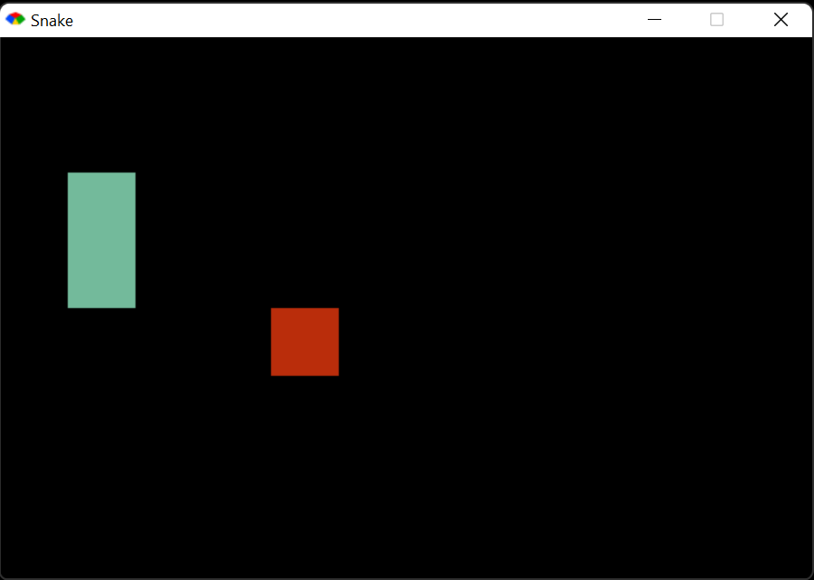
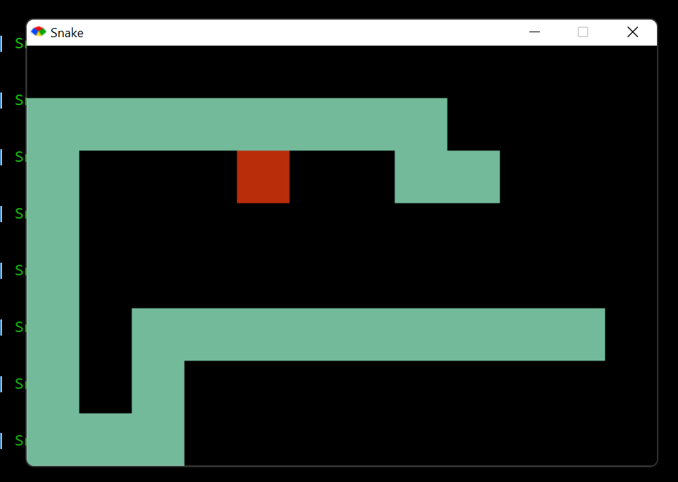

# Snake Game Ruby

Juego de Snake desarrollado en _ruby_ y _ruby2d_ (un _framework_ del mismo) ocupando el modelo-vista-acciones. 

Además, para su desarrollo se ocupó la metodología _[TDD](https://en.wikipedia.org/wiki/Test-driven_development)_.

## Prerrequisitos

- Tener instalado Ruby en el equipo, versión 2.5 o posteriores.

## Origen del proyecto

Proyecto realizado en el curso de Platzi: *Curso básico de Ruby* iniciado en Agosto del 2021.

## ¿Cómo iniciar el juego?

Una vez descargado el repositorio bastará con desplazarnos en nuestra terminal a la carpeta del proyecto:

~~~bash
cd Snake-game
~~~

Dentro de la carpeta del proyecto debemos ejecutar primero la instalación de las gemas de Ruby necesarias, eso se logra con:

~~~bash
bundle install
~~~

Después de un momento las gemas quedaran instaladas en nuestro equipo, ejecutaremos el comando:

~~~bash
ruby src/app.rb
~~~

Esto ejecutará el juego de _Snake_.

> Te recomendamos revisar las [buenas prácticas con ruby](assets/notes/buenas_practicas.md).

## Controles del juego

Funciona de igual manera que el juego clásico de Snake creado en los 80's. La linea verde representa la víbora y los cuadros rojos son las frutas que hay que comerse comoobjetivo principal del juego.

Cada vez que la víbora se come una fruta, se va a un contador que aumenta la velocidad a la que avanza la serpiente de manera paulatina.

Los controles para jugar _Sanke_ son las flechas de dirección del teclado.

- Arriba
- Derecha
- Izquierda
- Abajo

